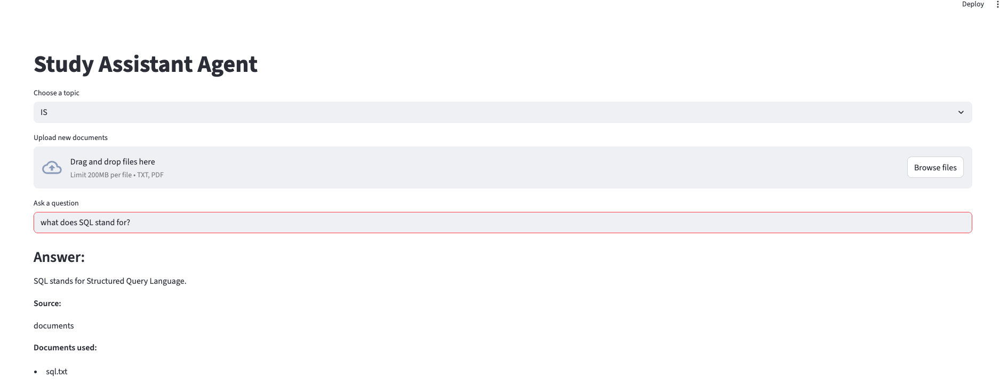
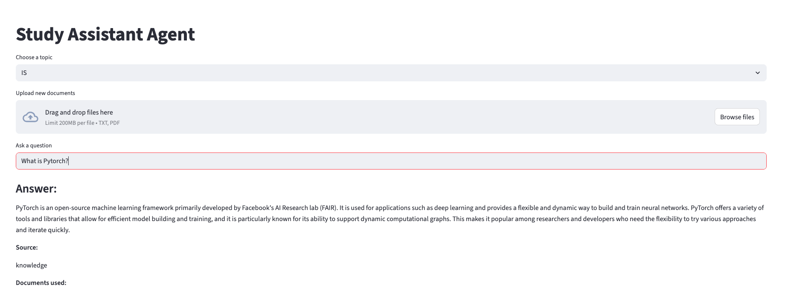

## Overview

The **AI Study Assistant Agent** is an intelligent tool designed to help users quickly find answers to their questions based on a personalized library of documents. This application leverages advanced Retrieval Augmented Generation (RAG) techniques, combining the power of Large Language Models (LLMs) with a robust vector database to provide accurate and context-aware responses.

Users can organize their study materials into different topics, upload new PDF or text documents, and then ask questions directly about the content within those documents.

### Diagram

## Key Features

* **Document Upload & Management:** Easily upload `.pdf` and `.txt` files into categorized topic folders directly from the web interface.
* **Topic-Based Knowledge Bases:** Organize study materials into distinct topics, allowing focused Q&A sessions.
* **Intelligent Text Processing:** Automatically extracts text from documents, chunks it efficiently, and generates high-quality embeddings using OpenAI's `text-embedding-3-small` model.
* **Efficient Information Retrieval (RAG):** Utilizes FAISS (Facebook AI Similarity Search) to quickly retrieve the most relevant document chunks based on semantic similarity to the user's query.
* **Context-Aware Q&A:** Passes retrieved context to OpenAI's `gpt-4o` LLM to generate precise answers, significantly reducing hallucinations and grounding responses in your source material.
* **Smart Routing & Intent Detection:** Dynamically routes user queries to the appropriate pipeline based on content type and query context.

## Technical Architecture

The application follows a standard RAG architecture, modularized into a Streamlit frontend and a Python backend for core logic:

1.  **Document Ingestion:**
    * **File Uploads:** Upload `.pdf` and `.txt` files into designated topic directories (`documents/<topic_name>/`).
    * **Text Extraction:** The `pypdf` library extracts text from PDF files, while plain text files are read directly.
    * **Chunking:** Extracted text is split into smaller, overlapping chunks (e.g., Max 4 sentences) to ensure that the LLM receives manageable and contextually rich segments.

2.  **Embedding Generation:**
    * **Vectorization:** Each text chunk is converted into a high-dimensional numerical vector (embedding) using OpenAI's `text-embedding-3-small` model. These embeddings capture the semantic meaning of the text.
    * **Persistence:** Generated embeddings are stored as NumPy arrays (`.npy` files) on disk, alongside their corresponding text chunks and original document names (`.json` files), enabling quick retrieval and persistence across sessions.

3.  **Vector Database (FAISS):**
    * **Indexing:** All generated embeddings for a selected topic are loaded and indexed using FAISS (Facebook AI Similarity Search). 

4.  **LLM-Powered Question Answering:**
    * **Contextual Prompting:** The retrieved document chunks serve as "context." This context, along with the user's original question, is fed into a well-crafted prompt for the OpenAI `gpt-4o` LLM.
    * **Source Attribution:** The system tracks which specific documents contributed the retrieved chunks, providing transparency and allowing users to verify the information.

5.  **Interact with the Agent:**
    * **Choose a topic:** Select one of your created topic folders from the dropdown.
    * **Upload documents (optional):** Use the file uploader to add more documents to the selected topic.
    * **Ask a question:** Type your question in the input box and press Enter.

    **Example: Querying on Uploaded File Content (SQL Document)**
    When your question is directly related to the content of files you've uploaded (e.g.,SQL.txt), the agent use that information to generate answer and cite the source.

    

    **Example: Querying with General Knowledge (No Related Documents)**
    If there are no relevant documents found in your selected topic to answer a specific question (e.g., asking about PyTorch when no PyTorch documents in folder), the model will use its general knowledge.

    

conda env list 
conda activate -- 
